.. Tkinter con Python3 documentation master file, created by
   sphinx-quickstart on Sat Jun 13 13:10:09 2020.
   You can adapt this file completely to your liking, but it should at least
   contain the root `toctree` directive.

Tkinter con Python3
===================

.. toctree::
   :maxdepth: 2
   :caption: Contents:

Introducción
================================================================================

Python es un lenguaje de programación muy potente que se caracteriza por incluir un montón de módulos en su instalación estándar. Uno de estos módulos es ``tkinter`` que permite la construcción de interfaces gráficas de usuario.

Este módulo incluye no solo muchos controles como botones o cajas de texto sino también dos **gestores de geometría** que permiten incluir elementos en una ventana y permitir a estos algoritmos el redibujado de controles cuando una ventana cambia de tamaño.

Sin embargo su uso puede ser relativamente complicado, especialmente al principio. En este documento se explica como trabajar con el gestor de geometría llamado ``grid``, el más flexible pero también el más complejo de usar de los dos.

Primer programa
================================================================================

Todo programa ``tkinter`` se caracteriza por

* Instancia un objeto de la clase ``Tk`` **una y solo una vez** . Este objeto es la "ventana principal" del programa.

* Debemos siempre llamar al método ``mainloop`` de este objeto. Este método tomará el control y se ejecutará hasta que cerremos la ventana (de hecho ejecuta el bucle de gestión de eventos de ``tkinter``) 

Un primer programa mínimo sería así:

.. literalinclude:: src/programa1.py
   :language: python

Y mostraría esto:

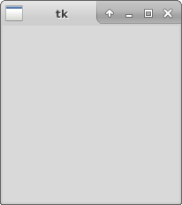

    Programa mínimo en tkinter

Añadiendo controles
================================================================================

En ``tkinter`` el proceso de construcción del GUI está basado en objetos pero la mecánica general es que **creamos objetos y en dicha creación indicamos qué objeto va a ser el padre o contenedor.** Este proceso es bastante distinto del de Java donde lo que se hace es crear un objeto contenedor, luego un control y luego llamar hace algo como ``contenedor.add(control)`` 

Así, por ejemplo, podemos añadir un botón a nuestra ventana usando un programa como el siguiente:

.. literalinclude:: src/programa2.py
   :language: python

Que mostraría esto:

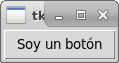

    Un botón en tkinter

El gestor de geometría ``grid`` 
================================================================================

En el programa anterior ya podemos ver que al usar ``grid`` debemos indicar la fila y la columna en la que se ubica el botón. Así, en el programa anterior hemos creado un botón y le hemos ordenador que se integre en la rejilla del contenedor padre (en este caso la ventana raíz) en la posición (0,0)

Es importante observar las diferencias de ``tkinter`` con respecto a otros lenguajes, como por ejemplo en Java. En Java se crea un contenedor, al contenedor se le asigna una geometría y luego se llama al método ``add`` del contenedor. Sin embargo, en ``tkinter`` el hijo "ordena indirectamente al padre" que se cree una rejilla. Recordamos también que en ``tkinter`` al crear un control se debe indicar en esa creación quien es el control padre o contenedor.

En un grid hay algunas consideraciones importantes:

* **Cuantas filas y columnas va a tener el grid**. Esta cantidad no se indica "a priori" sino que a medida que vayamos construyendo elementos podemos ir indicando nuevas coordenadas.

* **Cuantas filas y columnas va a ocupar un control** . Un control puede ocupar más espacio y no limitarse solo a "una celda de la tabla".

* **Qué peso va a tener cada fila y cada columna** . Si una ventana se redimensiona y se hace más grande o más pequeña podemos decidir como repartir proporcionalmente el espacio sobrante. Esto no es obligatorio de hacer pero ayuda a conseguir diseños bastante flexibles que se adaptan automáticamente a distintas resoluciones.

Veamos estos puntos uno por uno.

Filas y columnas de un grid
--------------------------------------------------------------------------------

Supongamos que queremos crear un interfaz como este:

.. figure:: ./img/programa3-1.png
    :align: center
    :figclass: align-center

    Una matriz de botones

Un posible programa podría ser este. Como se puede ver, se pueden usar los parámetros ``row`` y ``column`` para indicar la posición en la que debe ubicarse un control:

.. literalinclude:: src/programa3.py
   :language: python

Este programa parece tener un aspecto razonable. Pero veamos lo que ocurre si agrandamos la ventana:

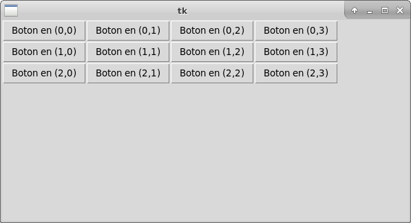

    Desaprovechamiento del espacio

Como vemos, al agrandar la ventana *los botones no se agrandan.* No solo se desperdicia espacio sino que también el aspecto del interfaz es poco profesional. Sin embargo este programa nos ha permitido ilustrar como funciona el posicionamiento de controles dentro de filas y columnas.

Anchura y altura de un control
--------------------------------------------------------------------------------

Un control no tiene por qué ocupar una sola "celda" de la rejilla. Usando parámetros como ``rowspan`` y ``columnspan`` se puede hacer que un control ocupe varias celdas tanto a lo ancho como a lo alto. Supongamos que creamos un programa como este, en el que se supone que hay un control que se extiende a lo largo de dos columnas (y por tanto debiera ser más ancho).

.. literalinclude:: src/programa4.py
   :language: python

Si lo ejecutamos observaremos esto:

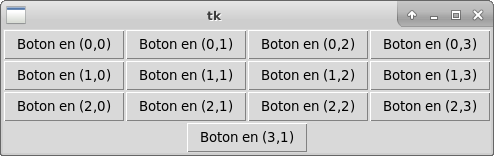

    Control que ocupa dos columnas

¿Qué ha pasado?

* El control **no se ha hecho más ancho** 
* El control también se ha desplazado y parece estar "en mitad de la tabla"

La respuesta es que **el grid/rejilla** ha reservado dos columnas para el botón pero **el botón no las está ocupando.** Esto se debe a que el botón no es tan ancho y le sobra sitio así que se limita a ser tan grande como el texto que contiene y el botón se sitúa en el centro de esa celda que mide dos columnas.

Aquí entra en juego otro parámetro: ``sticky`` . Este parámetro permite forzar a que un control que aún puede crecer "pegue sus paredes" al lado o lados que le indiquemos. Por ejemplo, en este programa, el mismo botón puede ocupar dos celdas, pero está pegado al lado "este" (derecha), simbolizado con la cadena "e".

.. literalinclude:: src/programa4-1.py
   :language: python

Si lo ejecutamos observaremos esto:

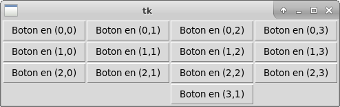

    Control con pared pegada al lado este.

En el parámetro ``sticky`` se pueden usar varios lados a la vez para así conseguir que un control que no aprovecha todo el espacio que se le da **se vea forzado a ensancharse por varios lados a la vez y así aprovechar el espacio**.

Así, este parámetro cobrará mucha importancia a la hora de diseñar interfaces de usuario que se adapten a distintas resoluciones y que por tanto aprovechen adecuadamente el espacio de pantalla extra que se nos pueda brindar.

Si aplicamos la técnica a nuestro programa tendremos este código:

.. literalinclude:: src/programa4-2.py
   :language: python

Que produce este resultado

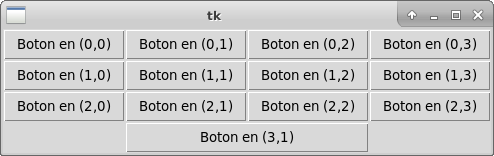

    Control ensanchado con ``sticky`` 

Ahora el interfaz **parece** funcionar como esperamos. Sin embargo, ¿qué ocurre cuando modificamos el tamaño de la ventana?

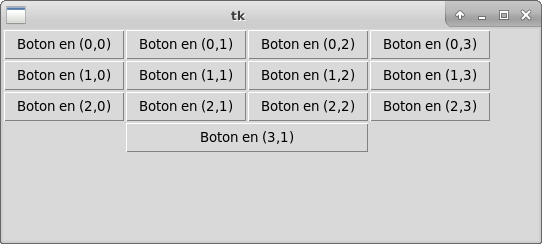

    Desaprovechamiento de espacio sobrante.

Como puede verse, aún no aprovechamos correctamente el espacio.

.. IMPORTANT::

   En realidad, ``tkinter`` proporciona las constantes tk.N, tk.S, tk.E y tk.W en lugar de las cadenas "n", "s", "e" y "w". Sin embargo, y dado que las constantes se han mantenido con estos valores durante años (en realidad durante décadas) se ha optado por usar las cadenas, ya que es más fácil escribir algo como "nsew" que ``tk.N+tk.S+tk.E+tk.W`` . Incluso aunque se importe el espacio de nombres entero en este caso usar cadenas parece aportar más claridad, de ahí el enfoque de este texto de ignorar tales constantes.

Peso de una fila o columna
--------------------------------------------------------------------------------

Hemos visto que:

* Las filas y columnas de un contenedor permiten diseñar el interfaz.
* A veces un control podría ocupar varias filas y columnas y **por defecto no ocupará el espacio sobrante** 

Aquí entra en juego el peso de las filas o columnas. Cuando diseñamos un interfaz basado en rejilla ocurre que por defecto **las filas y columnas no aprovecharán el espacio sobrante.** (este concepto ya debería sonarnos). Para permitir que se aproveche el espacio extra que pueda aparecer cuando se redimensiona una ventana podemos asignar a filas o columnas un **peso** 

Volvamos a tomar nuestro programa que crea una pequeña matriz de botones y asignemos por ejemplo un peso igual a cada fila.

.. literalinclude:: src/programa5.py
   :language: python

Que vuelve a producir este resultado en principio

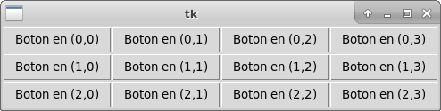

    Matriz de botones con pesos

Pero ahora veamos algo muy interesante. Cada fila tiene un peso (y de hecho todas tienen el mismo) ¿qué ocurre si aumentamos **la altura** de la ventana?

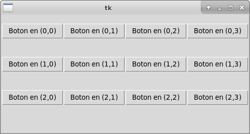

    Ventana con mayor altura

Ha ocurrido algo que debería sonarnos: los botones parece que ahora disponen de más altura **pero no la están aprovechando.** Probablemente se deba a que no hemos usado ``sticky`` para aprovechar ese espacio extra.

Modificamos el programa para que ahora los botones se ensanchen por arriba (norte, n) y por abajo (sur, s).

.. literalinclude:: src/programa5-1.py
   :language: python

Y si la ventana que produce el programa se hace más alta...

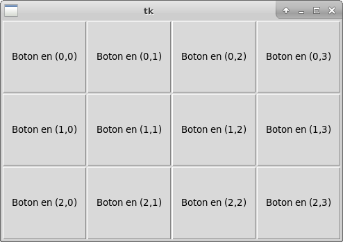

    Botones que aprovechan el espacio extra

¡Ahora sí se aprovecha la altura extra disponible! Ya tenemos un programa que parece adaptarse al espacio extra disponible. ¿Qué ocurre si hacemos la ventana más ancha por un lado?

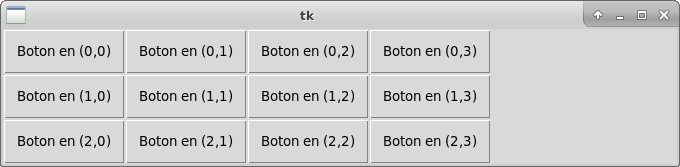

    Descompensación en el espacio por los lados

El resultado ya no debería sorprendernos. Sabemos que

1. Las columnas no tienen un peso asignado, así que no aprovechan el espacio disponible.
2. Aunque lo hiciesen, los controles no tienen el parámetro ``sticky`` para ordenarles que aprovechen el espacio por los lados.

Corregimos el programa...

.. literalinclude:: src/programa5-2.py
   :language: python

Y ahora podemos modificar libremente la ventana y veremos que todos los controles aprovechan el espacio disponible por cualquier dimensión.

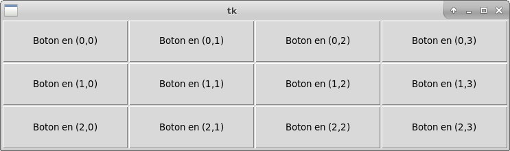

    Interfaz correctamente diseñado

Creando interfaces con ``tkinter`` 
================================================================================

Cuando se diseña un interfaz es raro que realmente se quiera hacer tan cuadriculado como el que acabamos de mostrar. Lo más normal es que se desee que los distintos controles ocupen distinto espacio en pantalla y que en caso de redimensionar siempre haya unos controles que sean más grandes que otros.

Todo esto puede conseguirse jugando con nuestros dos principales parámetros:

* El parámetro ``sticky`` usado cuando añadimos un control a un "grid".
* Y asignando **distintos pesos a las filas y columnas.** 

Por ejemplo, examinemos este programa, muy parecido a los anteriores pero en el cual configuramos algún peso de fila y columna de manera distinta. Para poder ver los efectos forzamos a que la ventana tenga inicialmente unas medidas de 600x600.

.. literalinclude:: src/programa6.py
   :language: python

En este programa los pesos se reparten:

* Peso 2 para la fila 0, peso 6 para la fila 1 y peso 2 para la fila 2. Lo representaremos como [2,6,2]
* Peso 2 para la columna 0, peso 4 para la columna 2, peso 2 para la columna 3 y peso 2 para la columna 3, o abreviadamente [2,4,2,2]

Si examinamos las filas veremos que la suma total de pesos es **10** . Esto significa que si hacemos la ventana más alta ocurrirá que **el espacio sobrante se repartirá proporcional a los pesos.** Eso significa que si hacemos la ventana 100px más alta se darán 20px más a la fila 0, 60px más a la fila 1 y 20px más a la fila 2.

Si examinamos los pesos de las columnas veremos que el total ES **6**. Así, si hacemos la ventana más ancha se repartirá el espacio sobrante de manera que las columnas 0,2 y 3 obtendrán la misma cantidad, pero la columna 2 será siempre más ancha. Los pesos quedarán [2/10, 4/10, 2/10, 4/10]. Si hacemos la ventana más ancha, la columna 2 debe recibir el doble de ancho extra que la 0, la 1 o la 3.

Aquí podemos ver (usando un programa que muestra una regla en pantalla) que los repartos efectivamente corresponden con lo que hemos programado. En primer lugar mostramos la ventana y comprobamos que efectivamente mide 600px (o casi, las imágenes se han tomado con toda la precisión que se ha podido)

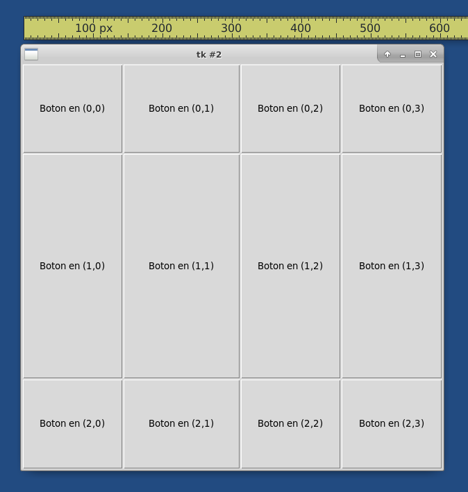

    Ventana inicial de 600x600

Si examinamos la regla veremos que las medidas son más o menos así:

* Columna 0: 140px.
* Columna 1: 180px.
* Columna 2: 140px.
* Columna 3: 140px.

Es decir, en total 600px. Despues hemos cambiado el tamaño de la ventana y la hemos hecho de 900px de ancho (que se muestra en la figura siguiente)

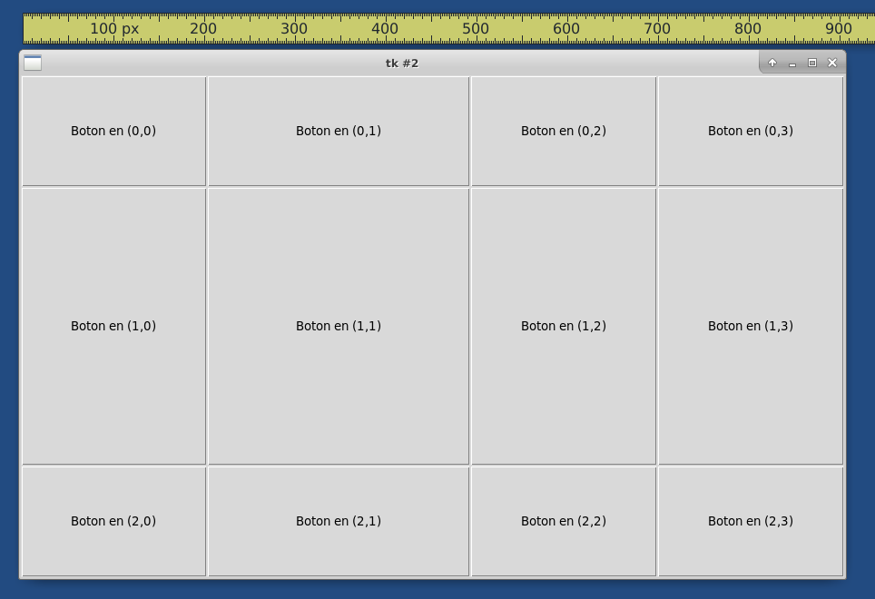

    Comprobación del reparto de pesos en vertical.

Ahora las medidas son así:

* Columna 0: 200px.
* Columna 1: 300px.
* Columna 2: 200px.
* Columna 3: 200px.

Si examinamos la hoja de cálculo siguiente veremos cuantos pixeles extra ha recibido cada columna.

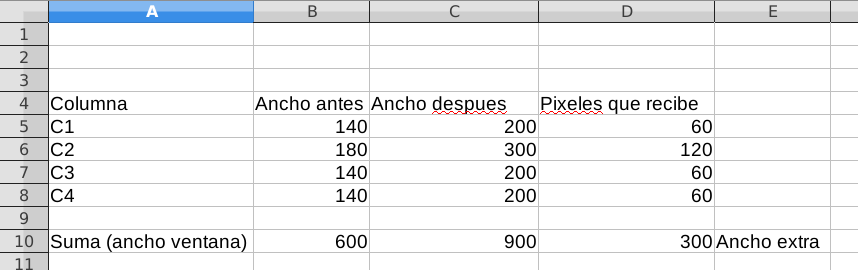

    Hoja de cálculo con las matemáticas de los cambios

En ella podemos ver que efectivamente, la columna 2 ha recibido el doble de espacio extra que las otras columnas. De todas maneras, el algoritmo de asignación de espacio dice en su documentación más o menos lo siguiente: "el algoritmo de asignación de espacio extra respetará en la medida de lo posible los pesos", con lo cual no se deben esperar garantías en cuanto a la colocación exacta de los elementos.

Indices y tablas
==================

* :ref:`genindex`
* :ref:`modindex`
* :ref:`search`
